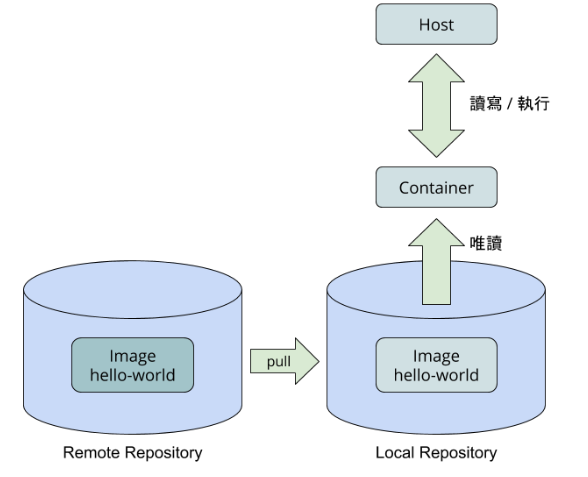

# docker

## docker 工具介紹
- Image 像光碟片一樣，唯讀且不能獨立執行
- Container 像硬碟一樣，可讀可寫可執行
- Repository 則是光碟盒，而 Registry 則是像光碟零售商

### 印出所有的容器

``` bash 
docker ps -a
```
### 刪除container

``` bash 
docker rm $(id)
```

### 印出所有image

``` bash 
docker images
```
### 刪除image

``` bash 
docker rmi $(id)
```
### 運作流程




## 日期進度

### 9/26 安裝kinetic 

start啟動不了

### 10/6
安裝docker中gui的模組


```bash
apt install xli 
```

ps:可以把容器執行的畫面傳送到host螢幕上

### [參考網站](https://newtoypia.blogspot.com/2018/07/docker-gui.html)

在host上查看自己
```bash
echo $UID $USER
```

啟動docker以及建制環境

```bash
docker run -it --name xwin -e DISPLAY=$DISPLAY -v /tmp/.X11-unix:/tmp/.X11-unix -v /home/ckhung/data:/tmp/exdata ubuntu:18.04 bash
```

### 進去後要增加使用者
        useradd -m -s /bin/bash -u 1000 fxrbindi
- #### DISPLAY=$DISPLAY

        $display螢幕的環境

- #### tmp/.X11-unix:/tmp/.X11-unix

        tmp,設置兩邊x11的環境

- #### /home/ckhung/data:/tmp/exdata

        透果路徑環境,host跟container可以同時指向同一個資料夾
-v /dev/video0:/dev/video0
-v /dev/video1:/dev/video1
-v /dev/video2:/dev/video2
-v /dev/video3:/dev/video3
00 fxrbindi
```

容器內變成新的user

```bash
su fxrbindi
```


docker run -it -v /dev/video0:/dev/video0 -v /tmp/.X11-unix:/tmp/.X11-unix -e DISPLAY=$dDISPLAY --name ros_container1 8c bash


docker run -it -v /dev/video0:/dev/video0 -v /dev/video1:/dev/video1 -v /dev/video2:/dev/video2 -v /dev/video3:/dev/video3 -v /tmp/.X11-unix:/tmp/.X11-unix -e DISPLAY=$dDISPLAY --name ros_container2 ce bash

Failed to connect to Mir:Failed to connect to server socket:No such file or directory

        export DISPLAY=:0 


sudo docker run -ti -v /dev/video0:/dev/video0 -v /dev/video1:/dev/video1 -v /dev/video2:/dev/video2 -v /dev/video3:/dev/video3 --device-cgroup-rule 'a 111:* rwm' -v /tmp/.X11-unix:/tmp/.X11-unix -e DISPLAY=$DISPLAY ros_container1 /bin/bash
## 可以看畫面跟聽聲音設定
### dev/console是host的揚聲器（喇叭）
        docker run -it DISPLAY = $DISPLAY --name = firefox -v /tmp/.X11-unix:/tmp/.X11-unix -v dev/console:dev/console -v firefox:test

