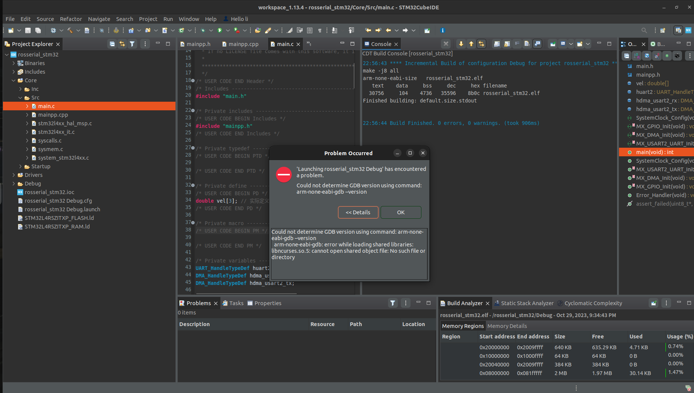

# ROS1開發筆記

### 模擬機手臂
建置虛擬模型

控制器Gazebo

模型 URDF 將3D模型插入UADF中，建立敘述套件

## 計算圖層(computation graph)

- Massage:各節點的通訊，透過定義的資料結構
- Topic:中心點，節點將資料上傳，個節點透過訂閱的方式取得訊息
- Service:透過reply and request的方式
- client端發送request後，須等伺服器reply才結束
- Bag:透過rosba感測，將傳感器的值打包，即可放置另主機觀測

## 日期進度

Ubuntu安裝ros

### 9/8 
- 安裝ubuntu 20.04 juammy
- 發現沒有 release ros1 
- 換ubuntu focal

- 安裝ros1 

- 成功啟動小烏龜

- Ros-turtlesim

- Roscore建立topic

- Rosrun turtlesim tirtlesim_node建立tirtlesim_node節點

- Rosrun turtlesim draw_square 讓小烏龜執行畫正方形的任務


## turtlesim 啟動畫面


### 9/11

完成使用usb_cam + image_view
graph


     rosrun image_view image_view image:=/usb_cam/image_raw
### 9/17
#### face_tracker_pkg臉部追蹤
遇到找不到kobuki_gazebo_plugins套件
導致catkin_make無法正常運行

在ros-wiki中kobuki_gazebo_plugins只有
這個版本
我使用的ubentu是20.04

ros版本是notic

notic為ros1的最後一個版本,很多package沒有更新過來
### 10/15
建立ros_aiml

使用PyAIML

AIML檔說明
模板對話

使用者輸入 my name is fxrbindi

系統回應 nice to see you
```AIML
<category>
    <pattern>
       my name is * 
    </pattern>
    <template>
        nice to see you 
    </template>
</category>

```
#### pyaiml
```python
import aiml
bot.aiml.Kernel()
bot.setBotPredicate("name",JIBO)
bot.learn('sample.aiml')
print bot.respond("MY NAME FXRBINDI")
```

### 安裝ROS sound play

```bash
sudo apt-get update
```
安裝 libgstreamer


## 完成docker env、ros workspace

### - ubuntu16.04
### - python2.7
### - ros kinetic

### 目前位置docker contrainer d0

    docker run -it -v /dev:/dev -e DISPLAY:$DISPLAY ...
    


## roslaunch 所有檔案 
docker 容器無法連接host的揚聲器

```bash
[WARN] [1697383034.902519]: Sound command issued, but no node is subscribed to the topic. Perhaps you forgot to run soundplay_node.py?
```


修改所有launch權限

```bash
sudo chmod +x *.launch
roslaunch ros_aiml start_chat.launch 
roslaunch ros_aiml start_tts_chat.launch 
roslaunch ros_aiml start_speech_chat.launch 
```


## 10/21

### 使用rosserial 連接stm32

### 10/28

### ubuntu更改系統預設路徑（中文-->英文）

    gedit ~/.config/user-dirs.dirs

新增或修改

    XDG_DESKTOP_DIR="$HOME/Desktop"  
    XDG_DOWNLOAD_DIR="$HOME/Download"  
    XDG_TEMPLATES_DIR="$HOME/Templates"  
    XDG_PUBLICSHARE_DIR="$HOME/Public"  
    XDG_DOCUMENTS_DIR="$HOME/Documents"  
    XDG_MUSIC_DIR="$HOME/Music"  
    XDG_PICTURES_DIR="$HOME/Pictures"  
    XDG_VIDEOS_DIR="$HOME/Videos"

####   ***須將所有的中文名稱改成英文才會同步

## stm32cubeide無法build,需要配置*.elf的檔案才能build

#### - 1.IDE內部生成project檔案有內含Debug檔案
#### - 2.STM32CubeMX裡面沒有

### 解決使用IDE內的檔案生成

## STM32CubeIDE 燒入 arm-none-eabi-gdb 

#### 找不到libncurses.so.5(需要額外安裝)

Could not determine GDB version using command 




    sudo apt-get install libncurses5 libncurses5:i386
    
    
## 10/31

stm32 uart 拒絕連線


## 使用新的workspace_1.13.5

使用stm32cubeide內生成l4r5 init file


建立inc製作.h檔案

    roslaunch rosserial_stm32 make_library.py 


將chatter內的Inc cp -avr 到workspace/rosserial/Inc/


建立
https://hackmd.io/@JINGCCC/rosserial_1?fbclid=IwAR3HZk-Y4dT-3glBGB2fagztaaS9PIjeFyiFROs-Ebdbmk028D78qVus07Y

環境建制完成

分析msg資料 
https://blog.csdn.net/qq_38288618/article/details/102931684

## - 或者在run configuration設定
##　- 生成方式ide(build compile)


cp -avr命令将以递归方式复制文件和目录

    https://www.youtube.com/watch?v=cq0HmKrIOt8&ab_channel=LearnembeddedsystemswithGeorge


### stm32cubeide無法build'project Explorer失蹤

- 設定workspace import .ioc

- 打開project explorer

- window -> show view

- 設定ln 硬連結(hard link)到workspace


hard link not allowed for directory

## rosserial


``` c
    /*
     * rosserial Publisher Example
     * Prints "hello world!"
     */
    
    // Use the following line if you have a Leonardo or MKR1000
    //#define USE_USBCON
    
    #include <ros.h>
    #include <std_msgs/String.h>
    
    ros::NodeHandle nh;
    
    std_msgs::String str_msg;
    ros::Publisher chatter("chatter", &str_msg); //把自己設定成公開者
    
    char hello[13] = "hello world!"; 
    
    void setup()
    {
        nh.initNode();
        nh.advertise(chatter);
        // 是用來告訴ROS節點要廣播（advertise）一個特定主題，讓其他節點可以訂閱它。這個操作通常在ROS節點初始化的過程中完成。
    }
    
    void loop()
    {
        str_msg.data = hello;
        chatter.publish( &str_msg );
        nh.spinOnce();
        delay(1000);
    }

```

## 10/31
完成uart-stm32連接

需要驗證的東西：

- 如何在stm32上收到host端傳送的資訊
- 從stm32上publish發布資料,用本機rostopic echo 
- 確認個節點的關西


### 錯誤訊息

the selection cannot be launch, and there are no recent
    
https://www.youtube.com/watch?v=oa95SuiNPcY&t=192s&ab_channel=easycoding

# 建立ros workspace

建立資料夾

```bash
mkdir –p ~/catkin_ws/src        
```

```bash
cd ~/catkin_ws/src
```
1

完成使用usb_cam + image_view
graph

 rosrun image_view image_view image:=/usb_cam/image_raw

# 建立ros workspace

建立資料夾

```bash
mkdir –p ~/catkin_ws/src
0


在ros工作空間新增額外資料夾，存放套件

```bash
cd  ~/catkin_ws/ && catkin_make
```

把工作空間環境加入.bashrc檔中

```bash
echo “source ~/catkin_ws/devel/setup.bash” >> ~/.
bashrc
```

重新加載

```bash
source ~/.bashrc

echo $ROS_PACKAGE_PATH
```
### 節點可視圖(topic,node)

```ros1
rostopic rpt-graph rpt-graph
```

- rostopic bw    
        display bandwidth used by topic
    
- rostopic delay    
    display delay of topic from timestamp in header
- 可以印出massage資料
    - rostopic echo    
    print messages to screen

    - rostopic find    
    find topics by type
    
    - rostopic hz    
    display publishing rate of topic    

### 印出publishers和subscribers指令


    rostopic info


print information about active topic

    rostopic list    
list active topics

### 指令透過publisher直接發送data 
    rostopic pub    
publish data to topic

### 傳送的資料格式    

    rostopic type    
print topic or field type

## Error
### 問題1

    ERROR: cannot launch node of type [usb_cam/usb_cam_node]: Cannot locate node of type [usb_cam_node] in package [usb_cam]. Make sure file exists in package path and permission is set to executable (chmod +x)
無法連接到node

解決 => 在catkin_make時有package沒有安裝到導致roslaunch時導入錯誤

### 問題2
    image_view無法透過usb_cam-test.launch開啟

解決=>在lauch後,使用rosrun 單獨建立node還需要解決
 ＝
安裝sound_play套件


